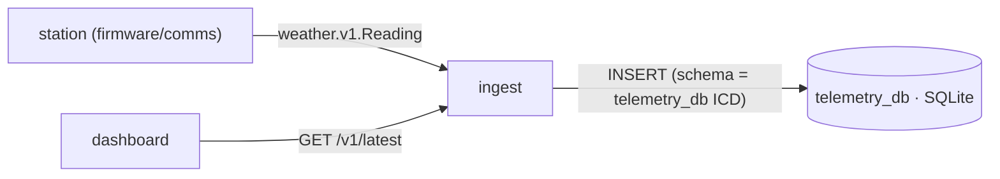

# backend · system

Receives uploads, stores them, serves them to the dashboard. Right-sized: one process and SQLite.

```mermaid
flowchart LR
  ST["station (firmware/comms)"] -- "weather.v1.Reading" --> ING["ingest"]
  ING -- "INSERT (schema = telemetry_db ICD)" --> DB[("telemetry_db · SQLite")]
  DASH["dashboard"] -- "GET /v1/latest" --> ING
```
