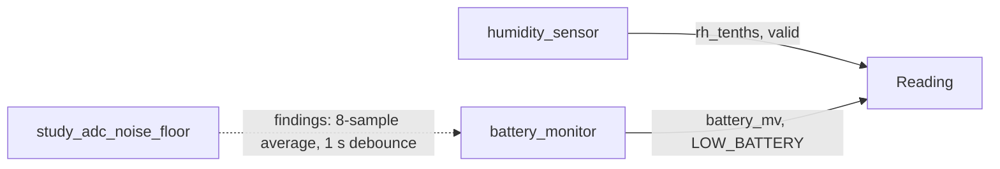

# sensing · system

Sensing subsystem: turns hardware readings into validated values.

```mermaid
flowchart LR
  HUM["humidity_sensor"] -- "rh_tenths, valid" --> OUT["Reading"]
  BAT["battery_monitor"] -- "battery_mv, LOW_BATTERY" --> OUT
  STUDY["study_adc_noise_floor"] -. "findings: 8-sample average, 1 s debounce" .-> BAT
```
