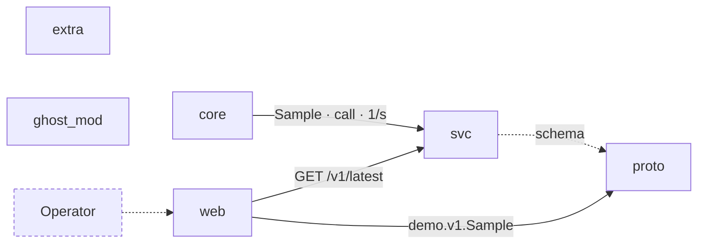

# poly · system

Polyglot fixture for the wiki map: C, C++, Python, TypeScript, JavaScript, proto, SQL, Go and Rust in one tree.

## Subsystems and interactions

```mermaid
flowchart LR
  %% tools is left out on purpose (UNDRAWN); GHOST matches no module (DIAGNODE)
  CORE["core"] -- "Sample · call · 1/s" --> SVC["svc"]
  WEB["web"] -- "GET /v1/latest" --> SVC
  WEB -->|"demo.v1.Sample"| PROTO["proto"]
  SVC -. "schema" .-> PROTO
  EXTRA["extra"]
  GHOST["ghost_mod"]
  OP["Operator"]:::ext -.-> WEB
  classDef ext stroke-dasharray: 4 3
```
