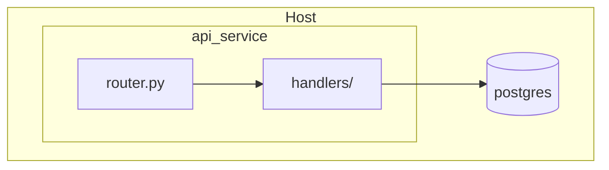
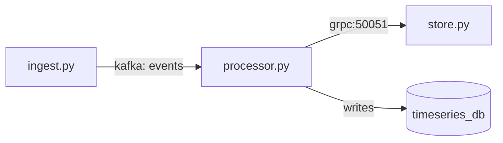
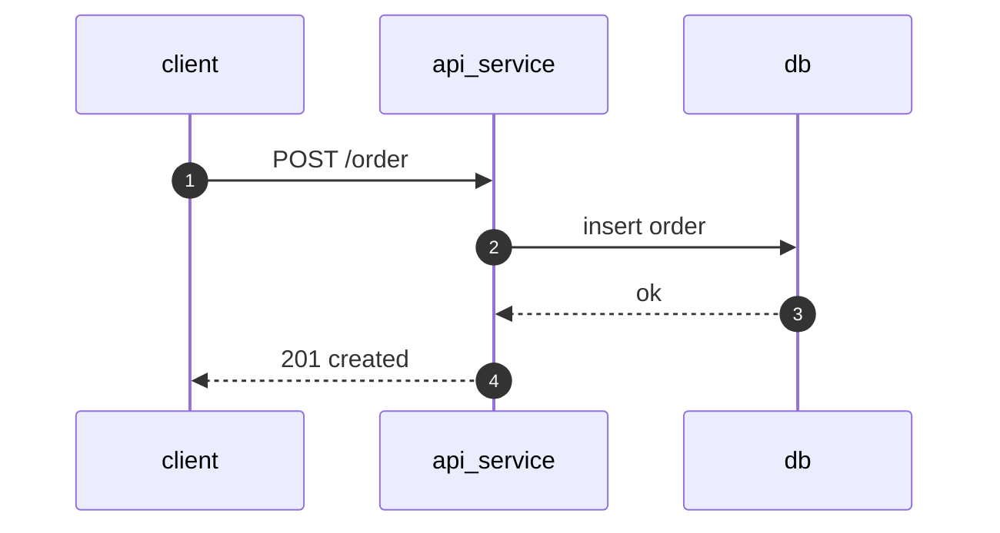
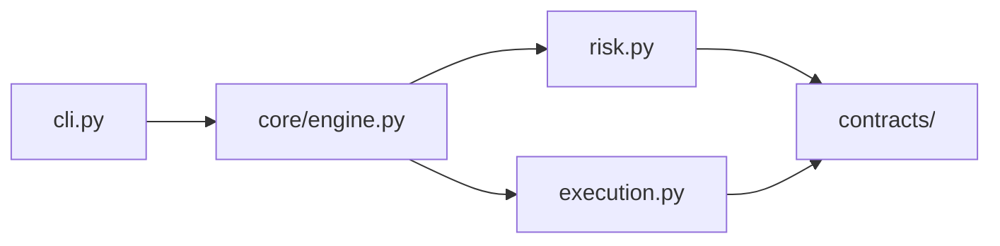
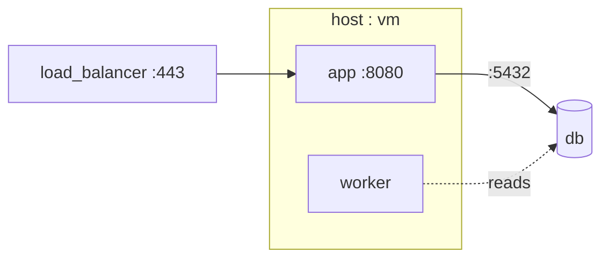

# /diagram — hand-authored Mermaid diagrams

Draw clean, intentional architecture and visualization diagrams in Mermaid for the current
project. **Curated by hand** from reading the code and docs — never dumped from a tool. Aim for
diagrams a reader digests at a glance.

## When to use
- The developer asks to **draw / visualize / diagram** a system, module, data flow, sequence,
  call graph, or deployment.
- You are writing or updating **architecture/design docs** and a diagram would carry the mental
  model better than prose.

## When NOT to use
- Non-Mermaid asset/image generation.
- Exhaustive machine-generated graphs — this skill **curates**, it does not dump tool output.

## Method
1. **Understand before drawing.** Read the relevant code **and** docs. Adopt the project's own
   vocabulary: look for a glossary (`GLOSSARY.md`, `docs/`, `README`), then fall back to the real
   identifiers in the code. Use names that already exist in the repo.
2. **Clarify with the developer when ambiguous** — don't guess on: which modules are in scope, the
   altitude, which archetype, where the boundaries are. One or two sharp questions beat a wrong
   diagram.
3. **Pick the archetype(s)** from the catalog. Often two complementary views (e.g. architecture +
   one sequence) beat a single overloaded diagram.
4. **Draft at subsystem altitude.** One box per meaningful module, **real names**, ~12 nodes max;
   if it would sprawl, split into several focused diagrams.
5. **Validate it renders.** Run `mmdc` (mermaid-cli) if available; otherwise check the syntax
   deliberately. A diagram that doesn't render is worse than none.
6. **Pair every diagram with short prose** — 1–3 sentences on what it shows and the one insight to
   take away.
7. **Place it (output mode C).** Ask whether to (a) write into the project's docs — detect where
   docs live (`docs/`, a subsystem `*_diagrams.md`, existing Mermaid usage) and respect that
   location's conventions (frontmatter, file naming) — or (b) hand it back standalone. **Never
   silently overwrite**: update a diagrams section or propose a new file.

## Two hard rules
- **Real names over abstractions.** Use module / file / class / contract names that actually exist.
  - Good: `auth_service.py --> token_store --> redis`
  - Bad: `Service --> Store --> Cache`
- **Subsystem altitude; split before you sprawl.** Default to module/subsystem level; go to
  function/line level only when explicitly asked. Several small diagrams beat one giant one.

## Archetype catalog (copy and adapt)

### 1. System architecture — nested containment

### 2. Component / data-flow — protocol-labeled edges

### 3. Sequence — one runtime interaction

### 4. Call / dependency graph — curated, module level

### 5. Deployment / topology — processes, ports, hosts

## Output contract
Every run yields: the **diagram(s)**, **render-validated**, each with **short prose**, **placed by
the project's convention** (or standalone on request), and **never a silent overwrite**.
